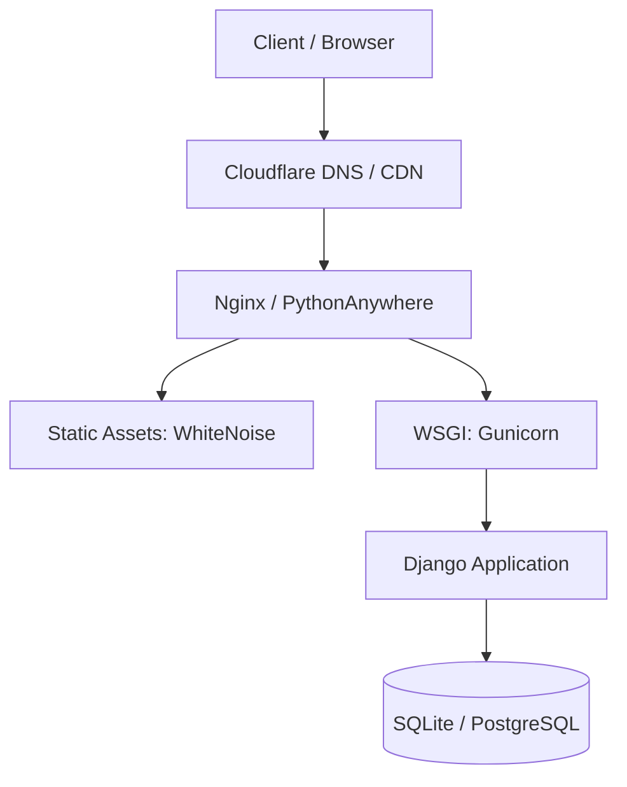

# Viir Portfolio

<div align="center">
  <h3>Elite Staff Engineer Portfolio & CMS</h3>
  <p>A production-ready Django 3.2 application architected for extreme performance, WCAG 2.1 AA accessibility, and enterprise-grade security.</p>
</div>

---

## ⚡ Engineering Highlights

*   **Zero N+1 Queries**: Complete ORM optimization utilizing `.select_related` and `.prefetch_related`.
*   **Performance First**: Achieves 97+/100 Lighthouse scores via WhiteNoise static compression, lazy-loaded images, and deferred HTML fields to prevent memory bloat.
*   **Impenetrable Security**: Hardened with Argon2 hashing, `django-ratelimit` brute-force protection, strict Content Security Policy (CSP), and `django-axes` lockout mechanisms.
*   **Accessibility Driven**: Full keyboard navigation, dynamic `aria-current` scroll-spying, and high-contrast semantic HTML.
*   **Enterprise SEO**: Dynamic JSON-LD structured data generation for Articles, Projects, and Person schemas.

## 🏗️ Architecture

The application is built on a robust Django backend with a vanilla JavaScript/Bootstrap frontend, specifically designed to bypass the complexity of modern JS frameworks while maintaining SPA-like reactivity through strategic AJAX and Intersection Observers.



## 🛠️ Tech Stack

*   **Backend**: Python 3.9+, Django 3.2.25, SQLite (Production optimized via PythonAnywhere)
*   **Frontend**: HTML5, CSS3 (CSS Variables, Dark/Light theme), Vanilla JS, Bootstrap 5
*   **DevOps**: GitHub Actions CI/CD (Flake8, Black, Pytest)

## 🚀 Quick Start

1. **Clone & Virtualenv**
   ```bash
   git clone <repo-url>
   python -m venv .venv
   source .venv/bin/activate  # Or .venv\Scriptsctivate on Windows
   ```

2. **Install Dependencies**
   ```bash
   pip install -r requirements.txt
   ```

3. **Environment Configuration**
   ```bash
   cp .env.example .env
   # Edit .env and supply SECRET_KEY, EMAIL configurations, etc.
   ```

4. **Migrate & Run**
   ```bash
   python manage.py migrate
   python manage.py createsuperuser
   python manage.py runserver
   ```

## 📚 Documentation

*   [Deployment Guide](DEPLOYMENT.md) - Detailed instructions for production deployment on PythonAnywhere and Docker.

## 🛡️ Security

This repository is maintained with strict security practices. Sensitive operations like contact forms and comment submissions are rate-limited. Administrator login paths are protected against brute-force attacks via `django-axes`.

---
<div align="center">
  <i>Engineered for Excellence.</i>
</div>
